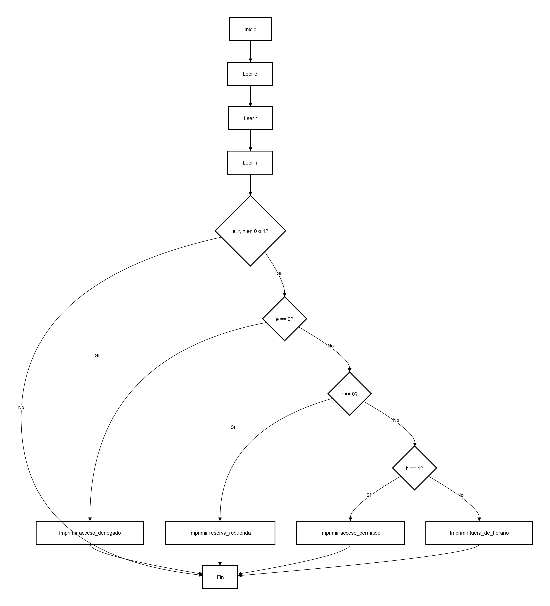

# Parcial - Pensamiento Algorítmico  
**Autor:** Yacobs Santiago Muñoz Rubio  
**Carrera:** Ciencias de la Computación e Inteligencia Artificial (Primer semestre)  

---

---

##  Ejercicios

### Ejercicio_1
Descripción: Algoritmo inicial del parcial.  
Archivo: `Ejercicio_1`

---

### Ejercicio_2
Descripción: Segundo algoritmo del parcial.  
Archivo: `Ejercicio_2`

---

### Ejercicio_3
Descripción: Tercer algoritmo del parcial.  
Archivo: `Ejercicio_3`

---

### Ejercicio_4
Descripción: Cuarto algoritmo del parcial.  
Archivo: (ejercisio_4)

---

### Ejercicio_5
Descripción: Quinto algoritmo del parcial.  
Archivo: `Ejercicio_5`  

---

## Diagrama de Flujo

